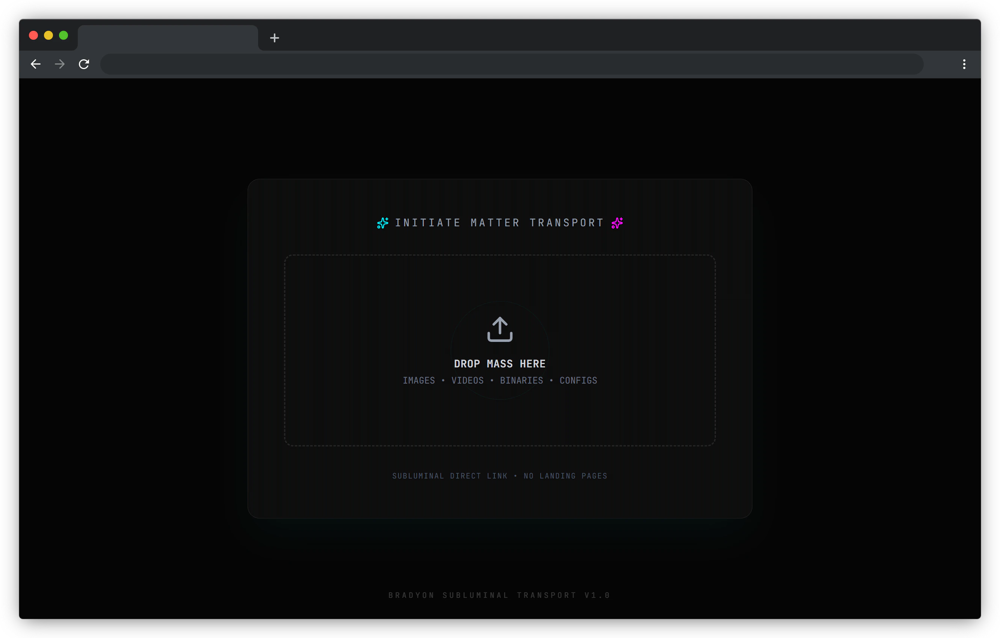
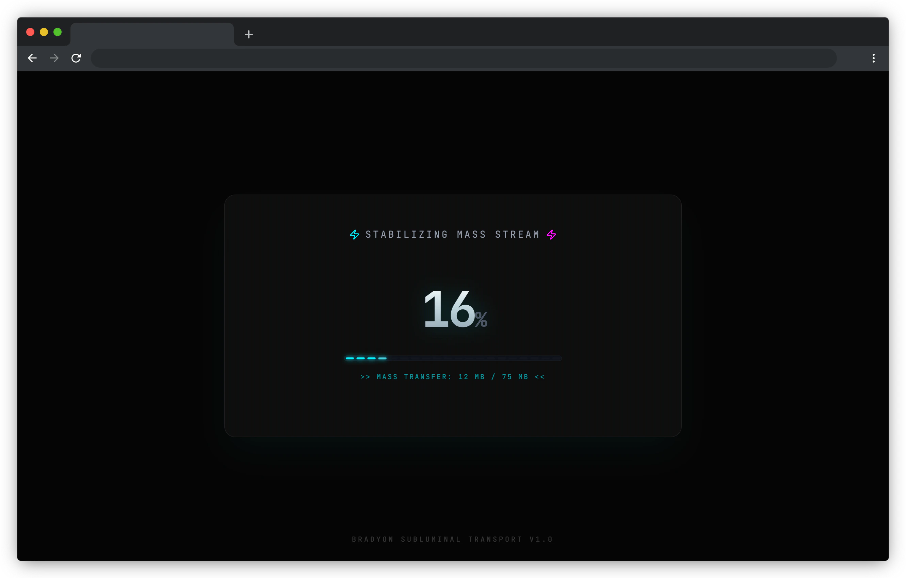
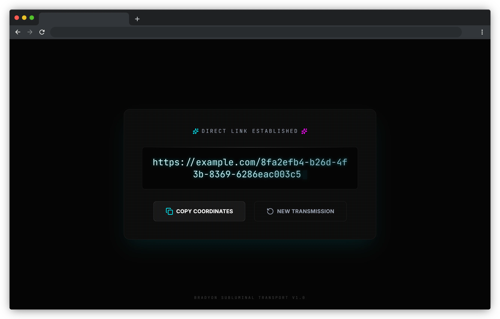

# 🐢 Bradyon


**Bradyon** 是一个基于 Cloudflare 生态系统构建的极简、开源文件转直链工具。它通过 Cloudflare Workers 和 Pages
部署，旨在提供一个稳定、极速且无干扰的原始文件访问方案。

## 🛠️ 为什么创建 Bradyon？

本项目起源于我在分享本地视频（比如用于 VRChat 的播放器）时的痛点。在尝试过市面上大多数方案后，我发现它们普遍存在以下问题：

* **拒绝直链**：大多数免费分享服务强制要求经过他们的门户网页。这种非直链（Non-Direct Link）不仅包含大量广告，且完全无法被
  VRChat、VLC 等播放器识别，导致分享失效。
* **严苛限制**：支持直链的服务通常会对单个文件大小（如 100MB 以内）进行极其严格的限制，若要解锁 GB 级的大文件上传，往往需要支付昂贵的月费。
* **网络瓶颈**：免费服务的服务器带宽通常处于低优先级。在多人同时观看或加载 4K/1080P 视频时，卡顿和缓冲是家常便饭，极大地破坏了社交体验。

**Bradyon 的目标是：利用 Cloudflare 强大的边缘计算与存储能力，为个人及好友间的小范围分享提供一个“纯净、不限速、无套路”的直链生成器。**

---

## 📸 截图

<p float="center">
   
   
   
</p>

---

## ✨ 项目核心优势

* **原生直链支持**：生成的链接直指源文件，完美适配所有支持 URL 加载的播放器。
* **极速全球分发**：依托 Cloudflare 节点，无论你和朋友身处何地，都能享受顶级 CDN 加速，告别视频卡顿。
* **免费部署**：完全利用 Cloudflare Workers 和 Pages 的免费额度，个人用户几乎可以实现零成本运行。
* **打破空间枷锁**：不设人为的文件大小限制，仅受限于你所选用的 Cloudflare 存储方案（如 R2）。
* **私有化部署**：代码开源，部署在自己的账号下，数据安全和访问权限完全由你掌握。

---

## 🌌 关于命名 (About the Name)

**Bradyon** (慢子) 源于希腊语 *bradys* (慢)，在物理学中指代所有运动速度低于光速的粒子（即我们熟知的质子、中子、电子等构成物质的粒子）。

取名的灵感来自于项目对**文件**的定义：

* **物质性 (Matter)**：与转瞬即逝的光子 (Luxon) 或虚构的快子 (Tachyon) 不同，Bradyon 代表了拥有**静止质量**
  的实体。在这里，每一个被上传的文件（视频、图像、程序）都被视为有分量的"物质"，而非仅仅是比特流。
* **亚光速传输 (Subluminal Transport)**：正如前端界面中的 *"Subluminal Direct Link"* 所暗示，我们不贩卖违背物理定律的虚假速度。Bradyon
  致力于在物理网络的限制下，利用 Cloudflare 强大的边缘计算能力，为这些"沉重"的实体文件提供最稳健、最高效的传输通道。

从某种意义上说，Bradyon 就是一个在数字宇宙中搬运实体的**物质传输机**。

---

## 🏗️ 技术架构

* **Cloudflare Workers**：负责处理 API 请求分发、鉴权及逻辑路由。
* **Cloudflare Pages**：承载精简的前端管理页面，提供直观的上传与管理体验。
* **Cloudflare R2 (推荐)**：作为后端对象存储，确保大文件的高可靠性。

---

## 🚀 部署指南

1. **准备账户**：注册并登录 [Cloudflare](https://dash.cloudflare.com/) 账号。
2. **准备存储**：在 Cloudflare 控制台创建 **R2** 存储桶和 **KV** 命名空间。
3. **克隆项目**：

```bash
git clone https://github.com/halifox/bradyon.git
cd bradyon
```

4. **安装依赖**：

```bash
pnpm i
```

5. **配置后端**：修改 `packages/backend/wrangler.jsonc`，填入你的 `kv_namespaces.id` 和 `r2_buckets.bucket_name`。
6. **部署后端**：将后端逻辑发布至 Cloudflare Workers。

```bash
pnpm --filter backend run deploy
```

7. **配置前端**：创建 `packages/frontend/.env.production` 文件，并填入后端接口地址：

```env
VITE_API_BASE_URL=https://你的后端Worker地址
```

8. **部署前端**：将管理界面发布至 Cloudflare Pages。

```bash
pnpm --filter frontend run deploy
```

---

## 🤝 贡献与反馈

如果你对 Bradyon 有更好的建议，或者在部署过程中遇到了障碍，欢迎通过以下方式参与：

* 提交 **Issue** 反馈 Bug。
* 发起 **Pull Request** 改进代码。

---

## ❓ FAQ (常见问题)

**Q: Bradyon 真的是完全免费的吗？**\
A: Bradyon 本身是开源免费的。其依赖的 Cloudflare 服务（Workers, Pages, R2）均提供非常慷慨的免费额度。对于个人用户和小规模分享，通常不需要支付费用。如果超出免费额度（如
R2 存储超过 10GB 或请求量巨大），Cloudflare 会按量计费。

**Q: 上传文件有大小限制吗？**\
A: Bradyon 前端采用了分片上传技术，理论上仅受限于您的 Cloudflare R2 存储桶容量。

**Q: 下载速度怎么样？**\
A: 下载通过 Cloudflare 的全球 CDN 网络分发，通常速度非常快且延迟低。但具体速度也取决于下载者的本地网络环境。

---

## 🙏 致谢 (Acknowledgements)

本项目离不开以下开源项目和服务的支持：

* [**Cloudflare**](https://www.cloudflare.com/) - 提供强大的边缘计算 (Workers)、静态托管 (Pages) 和对象存储 (R2) 服务。
* [**Hono**](https://hono.dev/) - 超快、超轻量的 Web 框架，完美适配 Cloudflare Workers。
* [**React**](https://react.dev/) & [**Vite**](https://vitejs.dev/) - 构建现代化前端界面的基石。
* [**Tailwind CSS**](https://tailwindcss.com/) - 实用优先的 CSS 框架，快速构建美观界面。
* [**Lucide React**](https://lucide.dev/) - 美观且统一的图标库。
* [**Framer Motion**](https://www.framer.com/motion/) - 丝滑的 React 动画库。

---

## 📜 开源许可

本项目采用 [GPL-3.0](LICENSE) 许可证 进行授权。
